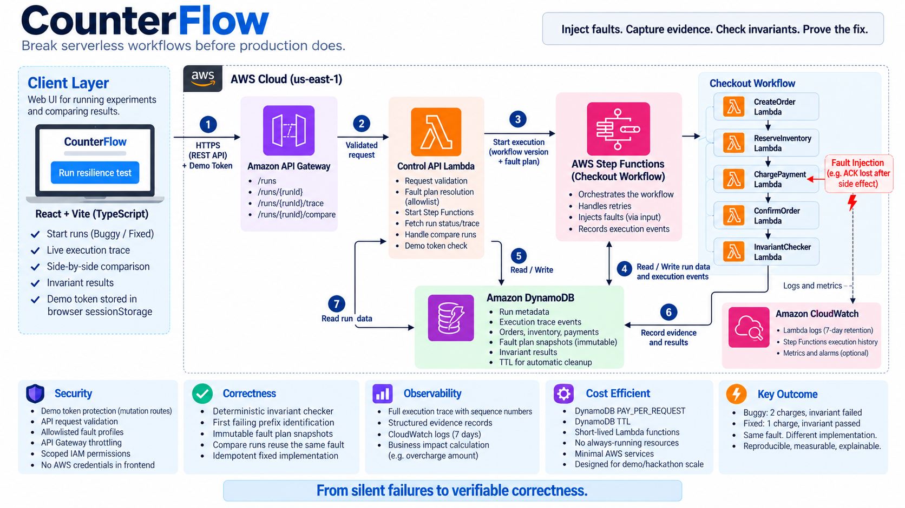

# CounterFlow

> **Break serverless workflows before production does — then show the exact event sequence that violated a business rule.**

CounterFlow is an AWS-native correctness-testing tool for event-driven and serverless workflows.

It injects reproducible failures into a simulated checkout workflow, records the resulting execution trace, evaluates business invariants deterministically, identifies the first failing trace prefix, and reruns the exact same fault against a fixed implementation.

The primary demonstration exposes a classic distributed-systems failure:

> A payment side effect commits successfully, but the acknowledgement is lost.  
> The workflow retries.  
> Without idempotency, the customer is charged twice.

CounterFlow makes that failure visible, reproducible, measurable, and comparable against the fix.

---

## Demo scenario

### Buggy implementation

```text
1 ORDER → 2 CHARGES

Expected:    ₹999
Charged:   ₹1,998
Overcharge:  ₹999

ChargeAtMostOnce: FAILED
```

Execution sequence:

```text
PaymentCharged
      ↓
ACK lost / timeout injected
      ↓
Retry
      ↓
PaymentCharged again
      ↓
Invariant violation
```

### Fixed implementation

The exact same stored fault plan is replayed against an idempotent payment implementation.

```text
1 ORDER → 1 CHARGE

Charged:      ₹999
Overcharge:     ₹0

ChargeAtMostOnce: PASSED
```

Execution sequence:

```text
PaymentCharged
      ↓
ACK lost / timeout injected
      ↓
Retry
      ↓
PaymentReused
      ↓
No second side effect
```

---

## Why CounterFlow exists

Retries are a normal part of serverless and event-driven systems.

A function can:

1. perform a business side effect,
2. fail before returning success,
3. be retried by the orchestrator,
4. perform the same side effect again.

Infrastructure may report that the workflow eventually completed successfully while the resulting business state is already incorrect.

CounterFlow tests the **business guarantee**, not just whether the workflow reached a terminal success state.

For the checkout demo, the core invariant is:

```text
ChargeAtMostOnce
```

For an order that has not yet been confirmed:

```text
committed payment charges <= 1
```

Once the order reaches `CONFIRMED`:

```text
committed payment charges == 1
```

The invariant checker is deterministic application code. An LLM does **not** decide whether a run passes or fails.

---

## Architecture

The following diagram shows how CounterFlow launches resilience experiments, orchestrates the checkout workflow, records evidence, evaluates invariants, and compares Buggy and Fixed implementations.



### Execution flow

1. The React + Vite frontend starts a resilience test through Amazon API Gateway.
2. The Control API validates the request, checks the demo token, and resolves an allowlisted fault plan.
3. AWS Step Functions orchestrates the checkout workflow and retry behavior.
4. Lambda functions execute the business workflow:
   `CreateOrder → ReserveInventory → ChargePayment → ConfirmOrder`.
5. DynamoDB stores business state, trace evidence, fault-plan snapshots, and invariant-related data.
6. The deterministic Invariant Checker evaluates `ChargeAtMostOnce` and identifies the first failing prefix.
7. The Control API returns the evidence to the frontend and can rerun the exact same stored fault against the Fixed implementation.

### Checkout workflow

```text
CreateOrder
    ↓
ReserveInventory
    ↓
ChargePayment
    ↓
ConfirmOrder
    ↓
InvariantChecker
```

Amazon Step Functions controls orchestration and retry behavior.

Amazon DynamoDB acts as the simulated business-state and evidence store.

---

## Fault model

The primary fault profile is:

```text
payment-ack-lost-v1
```

Fault type:

```text
AFTER_SIDE_EFFECT_TIMEOUT
```

Target:

```text
ChargePayment
```

Attempt:

```text
1
```

Behavior:

```text
ChargePayment writes PaymentCharged
        ↓
CounterFlow records the committed side effect
        ↓
Injected timeout occurs
        ↓
Step Functions retries ChargePayment
```

The original run stores the full resolved fault-plan snapshot and its canonical SHA-256 hash.

The Fixed comparison run reuses the same stored snapshot and hash rather than resolving the named profile again.

This ensures that the comparison changes the **implementation**, not the **experiment**.

---

## Buggy vs Fixed

### Buggy

The Buggy payment implementation creates a new charge identity on each invocation.

```text
Attempt 1
charge_A → committed

timeout

Attempt 2
charge_B → committed
```

Result:

```text
2 committed charges
ChargeAtMostOnce FAILED
```

### Fixed

The Fixed implementation uses an order-scoped deterministic payment identity and a DynamoDB conditional write.

```text
Attempt 1
charge_<orderId> → committed

timeout

Attempt 2
same charge identity
conditional write prevents another committed charge
PaymentReused recorded
```

Result:

```text
1 committed charge
ChargeAtMostOnce PASSED
```

The retry still occurs.

The difference is that the Fixed implementation is idempotent under the tested fault.

---

## First failing prefix

CounterFlow does not simply report that an invariant failed.

It identifies the earliest observed trace prefix at which the business invariant becomes false.

For the duplicate-payment demonstration:

```text
Sequence 6  PaymentCharged
Sequence 7  InjectedFailure
Sequence 8  ChargePayment retry
Sequence 9  PaymentCharged   ← FIRST VIOLATION
```

The frontend receives the first-failing-prefix information from the backend.

It does not independently recalculate invariant correctness in the browser.

---

## Evidence model

Each trace entry contains structured fields such as:

```text
runId
sequence
timestamp
component
operation
orderId
eventId
attempt
phase
outcome
evidence
```

Example operations include:

```text
OrderCreated
InventoryReserved
PaymentCharged
InjectedFailure
PaymentReused
OrderConfirmed
```

Execution attempts and committed business side effects are intentionally represented separately.

That distinction is essential for showing why a retry can be operationally successful while still producing an incorrect business state.

---

## API

### Start a run

```http
POST /runs
```

Example request:

```json
{
  "workflowVersion": "buggy",
  "faultPlanId": "payment-ack-lost-v1"
}
```

Mutation requests require:

```http
X-Demo-Token: <demo-token>
```

The Control API validates the workflow version and fault-plan ID before starting execution.

---

### Get a run

```http
GET /runs/{runId}
```

Returns information including:

- workflow execution status
- ordered trace evidence
- invariant result
- fault-plan information
- first-failing-prefix analysis
- business-impact data

---

### Get the trace

```http
GET /runs/{runId}/trace
```

Returns the ordered evidence trace for the run.

---

### Compare against Fixed

```http
POST /runs/{runId}/compare
```

Example request:

```json
{
  "clientRequestToken": "compare-request-001"
}
```

The comparison:

- uses the exact stored source fault plan,
- preserves the canonical fault-plan hash,
- runs the Fixed implementation,
- uses the client request token for idempotency.

Repeated compare requests using the same source run and client request token resolve to the same comparison run.

---

## Frontend

The UI is designed as a forensic execution viewer rather than a generic cloud dashboard.

The primary flow is:

```text
Launcher
    ↓
Live execution trace
    ↓
Buggy verdict
    ↓
Run same fault against Fixed
    ↓
Side-by-side comparison
```

### Visual semantics

```text
Ice / neutral  → normal execution
Amber          → deliberately injected fault
Violet         → retry / replay / reuse
Red            → invariant violation
Green          → passed invariant
```

The Buggy result prioritizes:

```text
1 ORDER → 2 CHARGES
₹999 overcharge
first failing sequence
```

The comparison prioritizes:

```text
SAME FAULT. DIFFERENT IMPLEMENTATION.
```

The Fixed path makes `PaymentReused` visible so the user can see why the retry did not create another committed payment.

---

## AWS services used

CounterFlow uses the following AWS services.

| AWS service | Purpose |
|---|---|
| Amazon API Gateway | Public REST API for starting, reading, tracing, and comparing runs |
| AWS Lambda | Control API and checkout business handlers |
| AWS Step Functions | Checkout orchestration and retry behavior |
| Amazon DynamoDB | Simulated business state, execution evidence, and immutable fault-plan data |
| Amazon CloudWatch | Lambda logs and operational visibility |
| AWS CloudFormation / AWS SAM | Infrastructure as code and deployment |
| AWS Amplify Hosting | Target hosting for the React/Vite frontend |

Infrastructure is defined in:

```text
template.yaml
```

Workflow definition:

```text
statemachines/checkout.asl.json
```

---

## Security and operational safeguards

The deployment includes:

- allowlisted fault profiles
- validation before workflow execution
- mutation-route demo-token protection
- API Gateway throttling
- DynamoDB TTL for temporary records
- 7-day Lambda CloudWatch log retention
- read-only DynamoDB access for the invariant checker
- scoped IAM permissions
- CORS configuration
- no AWS credentials stored in the frontend

The frontend keeps the demo access token only in browser `sessionStorage`.

The demo token is not intended to replace a production identity system; it is a lightweight protection mechanism for the hackathon deployment.

---

## Testing

The project currently contains:

```text
29 automated tests
```

Coverage includes:

- Buggy checkout without an injected fault
- Buggy checkout with the retry fault
- Fixed checkout without an injected fault
- Fixed checkout with the same retry fault
- invariant evaluation
- confirmed-order payment postcondition
- first failing prefix
- business-impact calculation
- Fixed `PaymentReused` behavior
- POST `/runs` contracts
- GET run contracts
- compare-run contracts
- fault-plan snapshot/hash preservation
- compare idempotency
- allowlisted fault-plan validation
- request validation
- demo-token protection

Run the full test suite:

```bash
python -m pytest -q
```

Expected:

```text
29 passed
```

Validate the SAM template:

```bash
sam validate --lint --region us-east-1
```

Build the backend:

```bash
sam build
```

Build the frontend:

```bash
cd web
npm install
npm run build
```

Current verified local release-candidate status:

```text
29/29 tests passing
SAM template valid
SAM build successful
Frontend production build successful
```

---

## Local setup

### Prerequisites

- Python 3.12+
- Node.js and npm
- AWS CLI
- AWS SAM CLI
- Git

Clone the repository:

```bash
git clone https://github.com/devaganesh-source/counterflow.git
cd counterflow
```

### Python environment

Create and activate a virtual environment.

Windows PowerShell:

```powershell
python -m venv .venv
.\.venv\Scripts\Activate.ps1
```

Install the project/test dependencies required by the repository.

Run tests:

```bash
python -m pytest -q
```

### Frontend

```bash
cd web
npm install
npm run dev
```

The Vite development server will print the local frontend URL.

---

## Deployment

Build the application:

```bash
sam build
```

Deploy:

```bash
sam deploy --guided
```

Recommended region:

```text
us-east-1
```

The deployment requires a `DemoToken` parameter for mutation endpoints.

Do **not** commit the real deployment token to the repository or expose it through a Vite build-time environment variable.

After backend deployment, use the CloudFormation `ApiUrl` output as:

```text
VITE_API_BASE_URL=<ApiUrl>
```

Then rebuild and deploy the frontend.

---

## Evaluation

Permanent-deployment results will be added after the final acceptance test.

| Scenario | Expected | Final measured result |
|---|---|---|
| Buggy / no injected fault | 1 committed charge, PASS | Pending permanent deployment |
| Buggy / `payment-ack-lost-v1` | 2 committed charges, FAIL | Pending permanent deployment |
| Fixed / no injected fault | 1 committed charge, PASS | Pending permanent deployment |
| Fixed / same stored fault | 1 committed charge, PASS | Pending permanent deployment |
| Fault-plan hash | identical between Buggy and Fixed comparison | Pending permanent deployment |
| Repeated compare token | same comparison run | Pending permanent deployment |
| Unauthorized mutation request | HTTP 401 | Pending permanent deployment |
| Trace endpoint | ordered trace returned | Pending permanent deployment |

Before recording the final demo, the full flow will be repeated multiple times and the measured results will be recorded here.

No reliability percentage or reproduction claim will be published until it is measured on the final deployment.

---

## Cost considerations

CounterFlow is designed for short-lived hackathon/demo workloads.

Cost-control decisions include:

- DynamoDB `PAY_PER_REQUEST`
- DynamoDB TTL for temporary records
- short-lived Lambda invocations
- API Gateway throttling
- 7-day Lambda CloudWatch log retention
- no always-running application compute
- no required Bedrock dependency

Actual cost depends on region, execution volume, logging volume, and deployment duration.

---

## Limitations

CounterFlow intentionally demonstrates a narrow correctness problem rather than claiming to solve every distributed-systems failure.

Current limitations include:

- one primary checkout workflow
- one primary injected fault profile
- one production invariant
- simulated payments and inventory instead of external payment/inventory providers
- no exhaustive exploration of distributed-system state space
- no automatic discovery of arbitrary business invariants
- no Bedrock dependency in the correctness path
- demo-token protection rather than a full production authentication system

A passing result means:

> **The tested invariant survived the tested fault plan.**

It does **not** mean the entire system is bug-free or universally safe.

---

## AI-tool disclosure

AI-assisted development tools were used during implementation for activities such as:

- brainstorming
- code review
- debugging assistance
- documentation drafting
- test-case suggestions
- UI/design iteration

All correctness decisions used by the running product are implemented by deterministic application code.

AI output does not determine invariant PASS/FAIL results.

All generated or suggested implementation changes were reviewed and tested by the team before inclusion.

---

## Team

### Deva Ganesh — Builder A, correctness and backend

Primary responsibilities:

- workflow correctness logic
- run and fault-plan model
- fault injection behavior
- Buggy and Fixed payment implementations
- deterministic invariant checker
- first failing prefix
- Control API
- backend request validation
- comparison semantics
- automated tests
- backend security and PRD hardening
- technical architecture explanation

### Siddharth — Builder B, delivery and experience

Primary responsibilities:

- AWS SAM infrastructure and deployment support
- frontend implementation
- live execution timeline
- Buggy/Fixed comparison UI
- invariant/result visualization
- forensic visual system
- demo interaction flow
- deployment verification
- final UI polish

### Shared responsibilities

- architecture decisions
- security review
- end-to-end testing
- README and evaluation
- final deployment validation
- demo rehearsal
- submission packaging

---

## Repository structure

```text
counterflow/
├── docs/
│   └── counterflow-architecture.png
│
├── services/
│   ├── create_order/
│   ├── reserve_inventory/
│   ├── charge_payment/
│   ├── confirm_order/
│   ├── invariant_checker/
│   └── control_api/
│
├── shared/
│   └── ledger.py
│
├── statemachines/
│   └── checkout.asl.json
│
├── tests/
│   ├── unit/
│   └── integration/
│
├── web/
│   └── React + TypeScript frontend
│
├── template.yaml
└── README.md
```

---

## Final product claim

CounterFlow is built to support one precise claim:

> We injected a reproducible failure after a simulated payment side effect. The Buggy workflow retried and produced two committed charges. CounterFlow's deterministic invariant checker identified the first failing trace prefix. After adding an idempotent conditional write, the same stored fault plan produced one committed charge and passed the invariant.

---

## Links

**Live demo:** `TODO_AFTER_PERMANENT_DEPLOYMENT`

**Demo video:** `TODO_AFTER_RECORDING`

**Repository:** https://github.com/devaganesh-source/counterflow

---

## Status

```text
Core implementation:       COMPLETE
PRD hardening:              COMPLETE
Frontend polish:            COMPLETE
Automated tests:            29/29 PASS
SAM validation:             PASS
SAM build:                  PASS
Frontend production build:  PASS
Permanent deployment:       IN PROGRESS
Final acceptance results:   PENDING
Demo recording:             PENDING
```